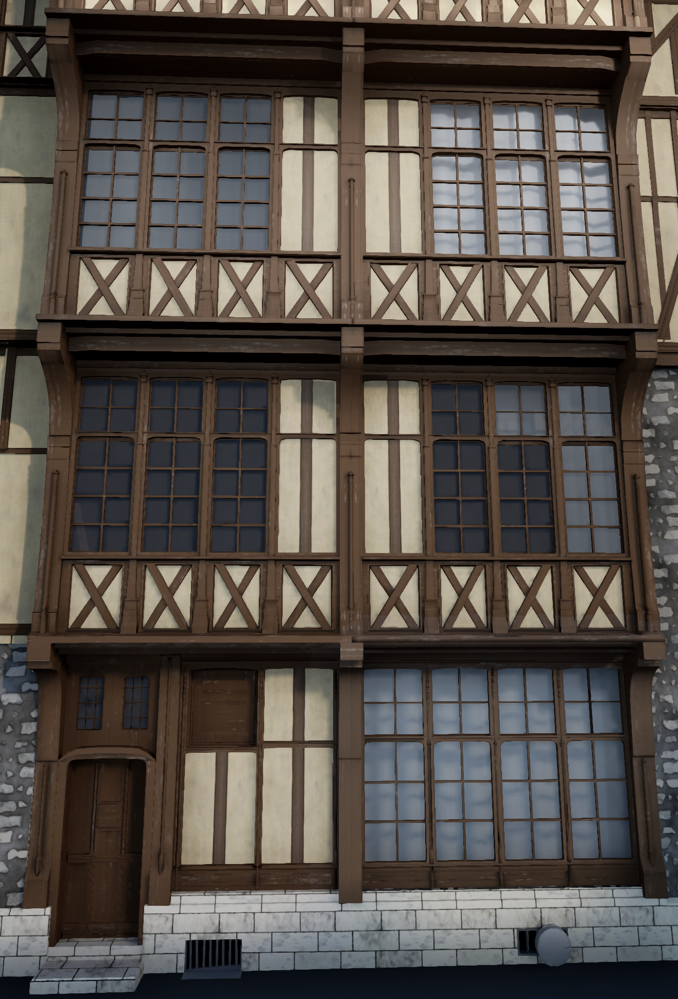

Modular Half-Timbered-House Break-down
===============

After 4 weeks I completed the first assignment of Vince Joyal's Advanced Seminar environment art class 
The goal of the assignment was to recreate a picture as closely as possible in 3D. Everything in the left picture is homemade.  

Click [here](https://www.artstation.com/dnompal) to go to my Artstation. 
Keep an eye on this blog as I'll be updating it with works in progress, thoughts on the industry, and various other topics related to art or the games industry.  